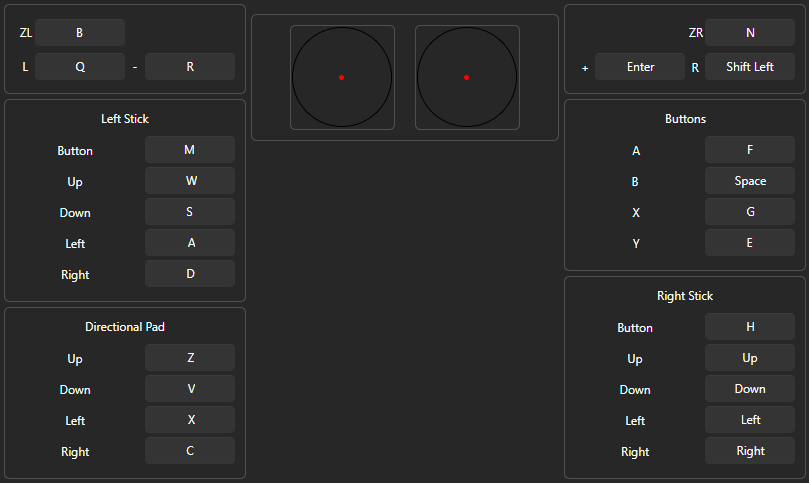

# MHGU Mouse Injector

A C++ external tool to inject mouse and keyboard control into **Monster Hunter Generations Ultimate** running on **Ryujinx**.

## Compatibility
*   **OS**: Windows 10/11 x64
*   **Emulator**: Ryujinx 1.3.3
*   **Game**: Monster Hunter Generations Ultimate 1.4 (Switch)

## Usage
1.  Launch **Ryujinx** and start **MHGU**.
2.  Run `main.exe`.
3.  The injector will wait for `Ryujinx.exe`.
4.  Once attached, it will hook into the camera memory.

> [!IMPORTANT]
> When you first launch the injector, you **MUST move the camera** in-game (during a Quest or Training) using the emulator's controls. The injector scans for the camera values changing.
> *   **Success**: The camera controls will be disabled in the emulator, and the mouse will take over.
> *   **Timeout**: If the addresses are not found within ~30 seconds of movement, restart the `main.exe` and try again.
> *   **Restriction**: Camera movement by mouse only works **during quests**, not in the Hub or menus.

## Recommended Controls
The following screenshot demonstrates the recommended control mapping in Ryujinx to work best with the default `config.json` settings:



### Controls
*   **F3**: Toggle Injector (Enabled/Disabled). also reloads `config.json`.
*   **END**: Exit the injector.
*   **Alt-Tab**: The injector automatically pauses (releases mouse) when Ryujinx loses focus.

## Configuration (`config.json`)
The tool uses a `config.json` file for keybindings and sensitivity.
*   **String Keys**: You can use key names like `"VK_SHIFT"`, `"SPACE"`, `"C"`, `"VK_LBUTTON"`.
*   **Multi-Key**: Assign multiple keys to one button: `"key_rmb": ["VK_SHIFT", "C"]`.

### Default Config
```json
{
    "invert_x": false,
    "invert_y": false,
    "sensitivity_x": 25.0,
    "sensitivity_y": 25.0,
    "key_lmb": ["C"],              // Left Click -> C
    "key_rmb": ["VK_F"],           // Right Click -> F
    "key_mmb": [""],               // Middle Click -> Unbound
    "key_x1": ["VK_F", "C"],       // Mouse Button 4 -> F + C
    "key_x2": ["VK_LSHIFT"],       // Mouse Button 5 -> Left Shift
    "key_mh_hold": "Q",            // Mouse Wheel only works when holding Q
    "key_mw_up": "E",              // Scroll Up -> E
    "key_mw_down": "VK_F"          // Scroll Down -> F
}
```

### Options
*   `key_mh_hold`: If defined, the mouse wheel will **only** function while this key is held down. Leave as `""` to always enable wheel.
*   **Note**: `key_mh_hold`, `key_mw_up`, and `key_mw_down` only support **ONE** key. You cannot assign multiple keys to these fields.

## Build Requirements
*   **Compiler**: Visual Studio 2022 (MSVC v143+)
*   **Build System**: CMake (3.20+)
*   **Generator**: Ninja (Optional, but recommended for speed)

## Build Instructions

### 1. Open Developer Command Prompt
Open "x64 Native Tools Command Prompt for VS 2022".

### 2. Configure and Build
Run the following commands in the project root:

```cmd
:: Create build directory and configure with Ninja
cmake -B build -G Ninja

:: Build the project
cmake --build build --config Release
```

The executable `main.exe` will be generated in the `build/` (or `build/Debug/`) directory.