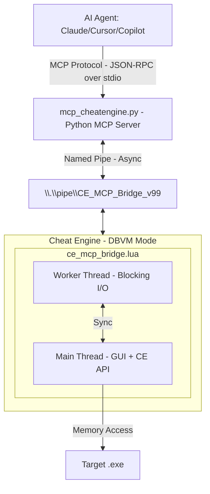

[Demo](https://github.com/user-attachments/assets/a184a006-f569-4b55-858a-ed80a7139035)

# Cheat Engine MCP Bridge

**Let multibillion $ AI datacenters analyze the program memory for you.**

Create mods, trainers, security audits, game bots, accelerate RE, or do anything else with any program and game in a fraction of a time.

[](#) [](https://python.org)

> [!NOTE]
> Thanks everyone for the stars, much appreciated! <3

---

## The Problem

You're staring at gigabytes of memory. Millions of addresses. Thousands of functions. Finding *that one pointer*, *that one structure* takes **days or weeks** of manual work.

**What if you could just ask?**

> *"Find the packet decryptor hook."*  
> *"Find the OPcode of character coordinates."*  
> *"Find the OPcode of health values."*  
> *"Find the unique AOB pattern to make my trainer reliable after game updates."*

**That's exactly what this does.**

_- Stop clicking through hex dumps and start having conversations with the memory._

---

## What You Get:

| Before (Manual) | After (AI Agent + MCP) |
|-----------------|---------------------|
| Day 1: Find packet address | Minute 1: "Find RX packet decryption hook" |
| Day 2: Trace what writes to it | Minute 3: "Generate unique AOB signature to make it update persistent" |
| Day 3: Find RX hook | Minute 6: "Find movement OPcodes" |
| Day 4: Document structure | Minute 10: "Create python interpreter of hex to plain text" |
| Day 5: Game updates, start over | **Done.** |

**Your AI can now:**
- Read any memory instantly (integers, floats, strings, pointers)
- Follow pointer chains: `[[base+0x10]+0x20]+0x8` → resolved in ms
- Auto-analyze structures with field types and values
- Identify C++ objects via RTTI: *"This is a CPlayer object"*
- Disassemble and analyze functions
- Debug invisibly with hardware breakpoints + Ring -1 hypervisor
- And much more!

---

## How It Works

---

## Installation

```bash
pip install -r MCP_Server/requirements.txt
```
Or manually:
```bash
pip install mcp pywin32
```

> [!NOTE]
> **Windows only** - Uses Named Pipes (`pywin32`)

---

## Quick Start

### 1. Load Bridge in Cheat Engine
```
1. Enable DBVM in CheatEngine.
2. File → Execute Script → Open ce_mcp_bridge.lua → Execute
```
Look for: `[MCP v11.4.0] Server started on \\.\pipe\CE_MCP_Bridge_v99`

### 2. Configure MCP Client
Add to your MCP configuration (e.g., `mcp_config.json`):
```json
{
  "servers": {
    "cheatengine": {
      "command": "python",
      "args": ["C:/path/to/MCP_Server/mcp_cheatengine.py"]
    }
  }
}
```
Restart the IDE to load the MCP server config.

### 3. Verify Connection
Use the `ping` tool to verify connectivity:
```json
{"success": true, "version": "11.4.0", "message": "CE MCP Bridge Active"}
```

### 4. Start Asking Questions
```
"What process is attached?"
"Read 16 bytes at the base address"
"Disassemble the entry point"
```

---

## 43 MCP Tools Available

### Memory
| Tool | Description |
|------|-------------|
| `read_memory`, `read_integer`, `read_string` | Read any data type |
| `read_pointer_chain` | Follow `[[base+0x10]+0x20]` paths |
| `scan_all`, `aob_scan` | Find values and byte patterns |

### Analysis
| Tool | Description |
|------|-------------|
| `disassemble`, `analyze_function` | Code analysis |
| `dissect_structure` | Auto-detect fields and types |
| `get_rtti_classname` | Identify C++ object types |
| `find_references`, `find_call_references` | Cross-references |

### Debugging
| Tool | Description |
|------|-------------|
| `set_breakpoint`, `set_data_breakpoint` | Hardware breakpoints |
| `start_dbvm_watch` | Ring -1 invisible tracing |

And many more at `AI_Context/MCP_Bridge_Command_Reference.md`

---

## Critical Configuration

### BSOD Prevention
> [!CAUTION]
> **You MUST disable:** Cheat Engine → Settings → Extra → **"Query memory region routines"**
> 
> Enabled: Causes `CLOCK_WATCHDOG_TIMEOUT` BSODs due to conflicts with DBVM/Anti-Cheat when scanning protected pages.

---

## Example Workflows

**Finding a value:**
```
You: "Scan for gold: 15000"  →  AI finds 47 results
You: "Gold changed to 15100"  →  AI filters to 3 addresses
You: "What writes to the first one?"  →  AI sets hardware BP
You: "Disassemble that function"  →  Full AddGold logic revealed
```

**Understanding a structure:**
```
You: "What's at [[game.exe+0x1234]+0x10]?"
AI: "RTTI: CPlayerInventory"
AI: "0x00=vtable, 0x08=itemCount(int), 0x10=itemArray(ptr)..."
```

---

## Project Structure

```
MCP_Server/
├── mcp_cheatengine.py      # Python MCP Server (FastMCP)
├── ce_mcp_bridge.lua   # Cheat Engine Lua Bridge
└── test_mcp.py # Test Suite

AI_Context/
├── MCP_Bridge_Command_Reference.md   # MCP Commands reference
├── CE_LUA_Documentation.md   # Full CheatEngine 7.6 official documentation
└── AI_Guide_MCP_Server_Implementation.md  # Full technical documentation for AI agent
```

---

## Testing

Running the test:
```bash
python MCP_Server/test_mcp.py
```

Expected output:
```
✅ Memory Reading: 6/6 tests passed
✅ Process Info: 4/4 tests passed  
✅ Code Analysis: 8/8 tests passed
✅ Breakpoints: 4/4 tests passed
✅ DBVM Functions: 3/3 tests passed
✅ Utility Commands: 11/11 tests passed
⏭️ Skipped: 1 test (generate_signature)
────────────────────────────────────
Total: 36/37 PASSED (100% success)
```

---

## The Bottom Line

You no longer need to be an expert. Just ask the right questions.

⚠️ EDUCATIONAL DISCLAIMER

This code is for educational and research purposes only. It's created to show the capabilities of the Model Context Protocol (MCP) and LLM-based debugging. I do not condone the use of these tools for malicious hacking, cheating in multiplayer games, or violating Terms of Service. This is a demonstration of software engineering automation.
